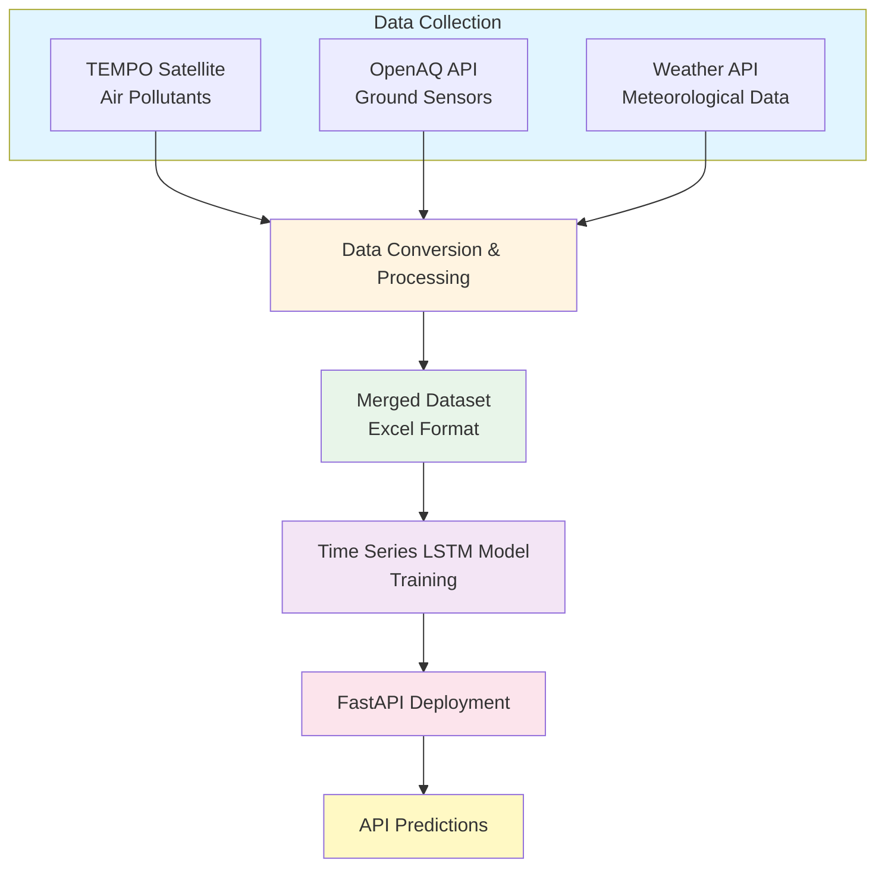

#  Breathe-Safe


**2025 NASA Space Apps Challenge – From EarthData to Action: Cloud Computing with Earth Observation Data for Predicting Cleaner, Safer Skies**

**Breathe-Safe** is a modern, open-source web application for **real-time air quality monitoring** and **public health awareness**.  
It leverages **NASA TEMPO** satellite data, **ground-based sensor networks**, and **weather integration** to deliver actionable insights, stakeholder dashboards, and educational resources for individuals, schools, emergency services, and policymakers.

---

## 🛰️ Project Overview
This project predicts air quality using multiple data sources and a **time-series prediction model**.  
The workflow includes **data collection**, **preprocessing**, **model training**, and **deployment via an API**.

---

## 📊 Data Sources
Data was collected from three main resources:

1. **NASA TEMPO** – Satellite-based measurements of air pollutants.  
2. **OpenAQ API** – Ground sensor measurements from multiple locations.  
3. **Weather Data API** – Meteorological parameters influencing air quality.

All collected data was converted into **Excel format** for easier handling and processing.

---

## 🧹 Data Processing
- Cleaning and preprocessing of collected datasets  
- Standardization of units and timestamp alignment  
- Merging datasets into a unified dataset ready for modeling

---

## 🤖 Modeling
- Implemented a **Time Series LSTM model** for air quality forecasting  
- Trained on historical data from combined data sources  

---

## ⚡ API Deployment
- Developed a **FastAPI endpoint** to serve model predictions  
- Users can request air quality forecasts by sending parameters to the API  

---

## 🔄 Project Flow



---

## 💻 Frontend

### 🌎 Key Features
- **Real-time AQI monitoring** and historical air quality trends  
- **Stakeholder views:** General Public, Schools, Elder Care, Emergency Response  
- **Integrated data sources:** NASA TEMPO, ground-based networks, weather data  
- **Past event storytelling:** Example – Las Vegas wildfire impact  
- **Health tips & awareness:** Actionable recommendations and resources  
- **Subscription system:** Receive AQI alerts for your city  
- **Modern UI:** Responsive, glassmorphism design with custom SVG illustrations  

---

## 🚀 Tech Stack
- **Angular 19** (standalone components)  
- **Chart.js / ng2-charts** for interactive visualizations  
- **TypeScript, HTML, CSS**  
- **Custom SVG assets** and illustrations  

---

## 🛠️ Getting Started
1. **Clone the repository**
   ```bash
   git clone https://github.com/<your-org-or-username>/Breathe-Safe.git
   ```
2. **Install dependencies**
   ```bash
   cd Web.Client
   npm install
   ```
3. **Run the development server**
   ```bash
   npm start
   ```
4. **Open** [http://localhost:4200](http://localhost:4200) in your browser.

---

## 📁 Frontend Project Structure
```
src/app/               → Angular components and routes  
src/assets/images/     → Custom SVGs and images  
public/                → Favicon and static assets  
```

---

## 🧠 Backend  
### 🌍 Breathe-Safe – Air Quality Prediction & Stakeholder Alerts

Part of the **NASA Space Apps Challenge – From EarthData to Action**,  
the backend combines **AI-powered air quality predictions** with **stakeholder notifications** to protect vulnerable groups, support decision-makers, and enhance public safety.

---

## 📌 Backend Overview

- **Data Input:** Send environmental features (CO, NO₂, O₃, PM₂.₅, PM₁₀) to a **FastAPI model**  
- **Prediction:** FastAPI returns the predicted **AQI (Air Quality Index)**  
- **Storage:** Predictions saved using a **generic repository pattern** with EF Core  
- **Categorization & Alerts:** Stakeholders notified when AQI exceeds thresholds  

---

## 🏗️ Architecture

### ✅ Models
- **`Subscriber`** – Represents stakeholders (Schools, ElderCare, Health Groups)  
- **`AirQualityPrediction`** – Stores prediction results (AQI, date, advisory)  
- **`AirQualityRequest`** – Input DTO for sending features to FastAPI  

### ✅ Services
- **`AirQualityPredictionService`**
  - Fetches predictions from FastAPI  
  - Stores them in the database  
  - Queries historical data (today, last week, last month)  
  - Triggers notifications based on AQI thresholds  

- **`SubscriberService`**
  - Manages subscribers  
  - Sends notifications to stakeholder groups  

---

## 📚 Repository Pattern
A **generic repository** provides CRUD operations for all entities, ensuring maintainability and clean architecture.

---

## ⚙️ Service Logic

### `AirQualityPredictionService`
- **AddAirQualityData** → Stores prediction and triggers AQI categorization logic  
- **GetAirQualityPredictionsAsync** → Calls FastAPI, saves results, and notifies stakeholders  
- **Query Methods:**
  - `GetTodayAirQualityFor(location)`  
  - `GetLastWeekAirQualityFor(location)`  
  - `GetLastMonthAirQualityFor(location)`  

#### AQI Threshold → Notification Rules
| AQI Range | Action / Stakeholders Notified |
|------------|-------------------------------|
| **101–150** | ElderCare, Industrial Zone Residents, Health-Sensitive Groups |
| **151–200** | Health-Sensitive Groups |
| **201–300** | Health-Sensitive + Disaster Readiness Orgs |
| **301–500** | All critical stakeholders (Health, Crisis, Meteorological, Govt, Public) |

---

### `SubscriberService`
- **AddSubscriber** → Registers a new stakeholder  
- **Notify** → Retrieves subscribers by type and (future) sends alerts via email, SMS, or push notifications  

---

## 🔗 API Integration
FastAPI endpoint is consumed via `.NET HttpClient` for prediction requests.

---

## 🤝 Contributing
Pull requests are welcome!  
For major changes, please open an issue first to discuss your ideas and improvements.

---

✅ **Maintained by the Breathe-Safe Team**  
🚀 *Empowering cleaner, safer skies through data-driven innovation.*
